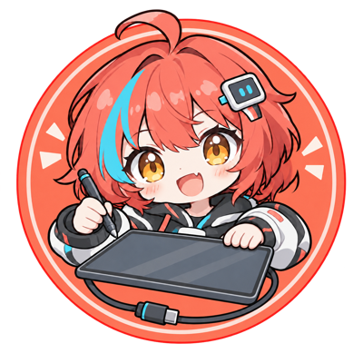
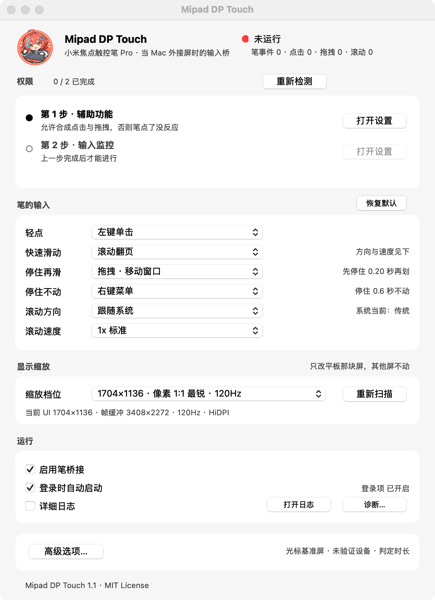

<div align="center">
  <h1 align="center">
    
    <br/>
    Mipad DP Touch
  </h1>

<p>
    让 <b>小米平板 9 Pro Max</b> 当 Mac 外接屏（DP-in）时，<b>小米焦点触控笔 Pro</b> 真正可用。
    <br/>
    不只是移光标 —— 是能<b>点击</b>、能<b>拖拽</b>、能<b>翻页</b>。
    <br/>
    <sub>Make the Xiaomi Focus Pen Pro actually usable on macOS when a Xiaomi Pad serves as an external DP-in display.</sub>
  </p>

<p>
  📖 <b><a href="https://inyvn.github.io/mipad-dp-touch/docs/index.html">在线网站 / 官网</a></b> — 动画操作教程 · 配置逐项说明 · 快速开始
  <br/>🌐 https://inyvn.github.io/mipad-dp-touch/docs/index.html
</p>
</div>

<div align="center">


[](LICENSE)
[](https://inyvn.github.io/mipad-dp-touch/docs/index.html)

</div>

<p align="center">
  
  <br/>
  <sub>设置窗口</sub>
</p>

---

## 它解决什么问题

一根 USB-C 全功能线把小米平板接到 Mac 雷雳口，平板就能当第二块屏（DP-in）。但是：

|              | 接上之后的表现                                                     |
| ------------ | ----------------------------------------------------------- |
| **macOS 原生** | 笔**能移动光标**，却**点不动** —— 点图标、点按钮毫无反应，窗口拖不动、文字也划不了选            |
| **装上本工具**    | 笔尖轻点 = 鼠标左键；**快速划动 = 翻页滚动**（不误选文字）；**停住再划 = 拖拽**（拖窗口、拖图标、拖滑块）；**停住不动 = 右键菜单** |

**原因不在线材、不在平板**：笔的触控走一条独立的 USB 接口。macOS 认得这个设备、能用笔的坐标移动光标，却**不把「笔尖按下」当成鼠标左键** —— Windows 接上免驱即用，Linux 也原生支持，只有 macOS 缺这层翻译。本工具补的就是这一层。

> **手指触控暂不可用** —— 平板在 DP-in 下认出 Mac 后只输出笔这一路，触摸屏的接口没建出来；
> 预计需要在平板上拿到 root 权限才可能解开。这块本工具管不了。

## ✨ 主要功能

* **🖊 轻点即点击** — 笔尖触碰 = 鼠标左键。落点取「按下瞬间」的位置，抬手时的手抖不会把点击带偏。

* **✋ 笔的四个手势** — **轻点** = 鼠标左键；**快速划动** = 滚轮翻页；**停住再划** = 拖拽（拖窗口、拖图标、拖滑块）；**停住不动** = 右键菜单。手势互不干扰：一手开始时是哪种，整手就按哪种走。想让**快速划动**直接划选文字，把它的动作改成「拖拽 · 选中文字」（老版本的「滑动选择」）；想让笔上按一下换屏，就把某一类改成**「切换屏幕」**。

* **🖱 右键菜单** — 笔尖停在原地不动、抬手即弹右键菜单（桌面、Finder、各种 App 里都能用）。判定时间四档：关 / `0.6s` / `0.8s` / `1.0s`。

* **🖥 笔上换屏** — 接了两块以上屏幕时，把某一类手势绑成**「切换屏幕」**：笔上按一下，光标基准屏就换到**下一块**（顺序 = 桌面排列从左到右，到头绕回第一块），不用再去点菜单栏。只换笔的落点，不改任何一块屏的分辨率 / 排列 / 镜像。

* **🎚 手感可调** — 「停住再划」的判定时间四档可选（默认 `0.25s`）：嫌误触就调慢，或者干脆关掉长按、只留点击和翻页。

* **🔍 字太小？一键放大还不糊** — 平板原生分辨率当界面用字太小，一键切到放大档（1704×1136、120Hz，画面仍是 1:1 像素，最清晰），随时能换回来。**只改平板那块屏**，其他屏不受影响。

* **🚀 开机自启** — 一个开关，登录后自动就绪；在「系统设置 → 通用 → 登录项」里可见、随时能关。

* **🔄 更新不用去 GitHub** — 有新版本时菜单栏会自己提示：点「下载并安装」就下载、按发版正文里的 SHA256 校验、替换 App 并自动重启；替换失败自动回滚到旧版。整个程序只有这一步会联网，不想让它查就把「高级选项 → 自动检查更新」关掉。

## 🚀 快速开始

1. **下载安装包** —— 在 [Releases](https://github.com/InYvn/mipad-dp-touch/releases) 里下 `Mipad-DP-Touch-1.1.dmg`（约 13 MB）
2. **拖进「应用程序」** —— 打开 DMG，把 App 拖到「应用程序」，然后双击它
   * 首次双击如果被系统拦下，见下面 [**首次打开被拦**](#-首次打开被拦)，一条命令就放行
3. **按提示分两步授权** —— ① 辅助功能 → ② 输入监控；两项都 ✓ 后点「立即重启」

然后用笔点一下图标 —— 能点开就成了。分步图文见 **[INSTALL.md](INSTALL.md)**。

## 📥 安装

**方式一：下载安装包（推荐）**

Releases 里的 DMG 打开就三样东西：App、一个「应用程序」快捷方式（**拖过去即安装**）、一份首次打开说明。装完想卸载：退出 App，把它从「应用程序」删掉即可。

**方式二：自己构建**

```bash
git clone https://github.com/InYvn/mipad-dp-touch.git
cd mipad-dp-touch
./build_app.sh      # 需要 uv（脚本自己准备 Python 环境）→ 产出 dist-pyi/Mipad DP Touch.app
./make_dmg.sh       # 想发给别人就再打个 DMG
```

### ⚠️ 首次打开被拦

* **推荐**：打开「系统设置 → 隐私与安全性」，在「安全性」一栏点被拦那条的 **「仍要打开」**，再确认一次。
* 或者终端一行：

```bash
xattr -dr com.apple.quarantine "/Applications/Mipad DP Touch.app"
```

* 装好之后 App 约占 **25 MB**。

* 系统要求：**macOS 27**（在 macOS 27.0 + Mac mini M4 上实测）。更老的系统**没有验证过** —— 报问题时请带上系统版本。

## 🖱 界面

**菜单栏**：

| 菜单项               | 说明                                                             |
| ----------------- | -------------------------------------------------------------- |
| 状态行               | 当前设备（如实显示「未运行」「等平板上线」）                                         |
| 完成授权…             | **只在权限不齐时出现**，点开设置窗口的分步引导                                      |
| 启用笔桥接             | 临时停用（不用拔线），勾选态 = 当前开关                                          |
| 清零计数              | 笔事件 / 点击 / 滚动 / 拖拽 计数归零                                        |
| 显示缩放 ▸            | 档位列表（`1704×1136`、`1280×853`…）+ 退回切换前的档位 + 重新扫描显示器 + 打开「显示器」设置… |
| 光标基准屏 ▸           | 笔的绝对坐标铺到哪块屏：**跟随光标**（默认，笔在光标那块屏上生效）/ 平板那块屏 / 任意一块在线屏 —— 接了第二块屏时靠它换屏 |
| 设置…               | 打开设置窗口（⌘,）                                                     |
| 打开日志              | 打开日志文件                                                         |
| 检查更新…             | 查一下有没有新版本（平时会自己查；下载中这一行会显示进度）                                      |
| 退出 Mipad DP Touch | ⌘Q                                                             |

**设置窗口**（⌘,）：

| 分区    | 内容                                                                                                |
| ----- | ------------------------------------------------------------------------------------------------- |
| 状态    | 连接状态 + 笔事件 / 点击 / 拖拽 / 滚动 实时计数                                                                    |
| 权限    | **分步引导**：① 辅助功能 ② 输入监控，上一步没完成下一步是灰的；每步一个「打开设置」；运行中授权后出现「立即重启」（TCC 要新进程才生效）；另有「重新检测」               |
| 笔的输入  | **按键绑定**：轻点 / 快速滑动 / 停住再滑 / 停住不动，每一类都能绑一个动作（默认 = 左键单击 / 滚动翻页 / 拖拽 · 移动窗口 / 右键菜单），一键**恢复默认**；多屏时可把某一类换成**切换屏幕**，笔上按一下换基准屏；另有滚动方向、滚动速度                                       |
| 显示缩放  | 档位下拉（带「像素 1:1 最锐」这类标注）+ 重新扫描；**只改平板那块屏**                                                          |
| 运行    | 启用笔桥接、登录时自动启动（以系统实际状态为准）、详细日志、打开日志、诊断…                                                            |
| 高级选项… | 独立小窗，放不常用的：光标基准屏、拖拽位置跟随笔尖、允许未验证的小米设备、允许管理未实测的显示器、两个「停住」判定时长、自动检查更新（+「立即检查更新」按钮）                        |
| 页脚    | 版本号                                                                                               |

菜单和设置窗口是**同一份状态的两个表面**，不会出现「菜单里勾着、窗口里没勾」。设置存在 `~/Library/Application Support/MipadDPTouch/config.json`。

## 📊 现状

| 能力                             | 状态           |
| ------------------------------ | ------------ |
| 设备识别                           | ✅            |
| **笔点击桥接**                      | ✅            |
| **笔拖拽**（拖窗口、划选文字、拖滑块）          | ✅            |
| **翻页滚动**（划动翻页，一个鼠标键都不发，绝不误选文字） | ✅            |
| **按键绑定可改**（轻点 / 快速滑动 / 停住再滑 / 停住不动 → 左键、右键、中键、双击、滚动、拖拽、空格、返回、切换屏幕，可一键恢复默认） | ✅            |
| **停住再划 = 拖拽**（默认绑定，可改）               | ✅            |
| **停住不动 = 右键菜单**（默认绑定，可改）            | ✅            |
| **显示缩放**                       | ✅            |
| 开机自启                           | ✅            |
| 手指触控                           | ⏳ **暂不可用**（预计需要 root） |

## 🔧 疑难解答

* **想弹右键菜单** → 笔尖停在原地不动，约 0.8 秒后抬手（默认绑在「停住不动」上，判定时长可以在「高级选项」里改成 0.6 / 1.0 秒，或者把这个手势绑成别的动作）。停住之后又划走的话仍算拖拽，不会误弹菜单。
* **拖不动窗口** → **把笔尖停住约四分之一秒再划**（拖拽默认绑在「停住再滑」上，判定时长在「高级选项」里调）。**划不了选文字** → 把**快速滑动**的动作改成**「拖拽 · 选中文字」**（快进快出划一段，老版本的「滑动选择」）；默认它绑的是**滚动翻页**，划动只滚动、一个鼠标键都不发（所以不可能误选）。改坏了点右侧「恢复默认」。
* **多屏想用笔换基准屏** → 把某一类手势绑成**切换屏幕**（例如把「停住不动」从右键菜单改掉）：笔上按一下 = 光标基准屏换到**下一块**屏，按桌面排列从左到右循环、到头绕回第一块。只换笔的落点，别的屏的分辨率和排列都不动；只接了一块屏时按了没反应（日志里写一句）。
* **设置窗口里的下拉框看着发灰、点一下没反应** → 窗口刚弹出时如果没抢到焦点，系统会把下拉框画成灰的。现在打开窗口会自动抢焦点；万一还遇到，点一下窗口本身再操作即可。
* **笔点了没反应** → 十有八九是权限。打开设置窗口看「权限」分区，分步做完两步（辅助功能 + 输入监控），然后点「立即重启」。注意 macOS 27 里「辅助功能」改名叫**「设备控制和数据访问」**了。
* **刚才还能用，更新完 App 就失效了** → ad-hoc 签名 + TCC 的老问题：重新授权一次即可（[INSTALL.md](INSTALL.md) 有专节）。**升级时 bundle id 故意保持不变**，就是尽量别让你重授权。
* **怎么更新** → 有新版本时菜单栏会自己提示，点「下载并安装」就不用管了；也可以点菜单栏 **检查更新…**，或「高级选项 → 立即检查更新」。下载完会按发版正文里的 SHA256 校验才替换，替换失败自动回滚。设置和日志在 `~/Library/` 里，更新不动它们。
* **光标不跟着笔走** → 打开「详细日志」：日志会列出笔的坐标和系统光标的差值。差得明显 = 光标没跟上笔；差值为 0 却点不动 = 事件发出去了、系统没认。
* **字太小 / 太糊** → 用菜单「显示缩放」切到 `1704×1136`（窗口的档位下拉里会标出「像素 1:1 最锐」）。别去系统设置里把分辨率拉低，那样会糊。
* **找不到窗口，只有一个 ✎ 图标** → 这就是菜单栏应用；点 ✎ → 「设置…」。
* **菜单栏图标亮着但显示「未运行」** → 等平板上线，或菜单里「启用笔桥接」被关掉了。

## 📚 文档

| 文档                           | 内容                        |
| ---------------------------- | ------------------------- |
| **[INSTALL.md](INSTALL.md)** | 安装、分步授权、界面说明、显示缩放、故障排除、卸载 |
| **[CHANGELOG.md](CHANGELOG.md)** | 每个版本改了什么 |

## ❤️ 许可

* 本项目 **MIT License**，见 [LICENSE](LICENSE)。
